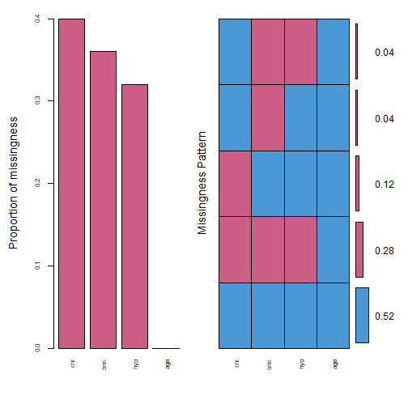
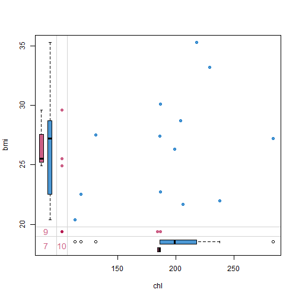
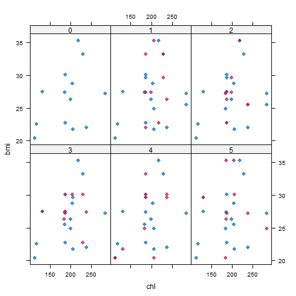
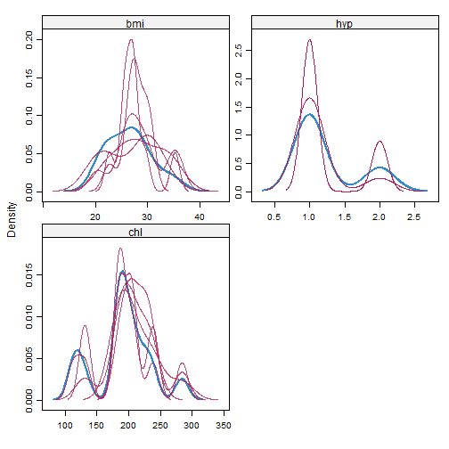

```r
#Types of Missing Values

#Missing values are typically classified into three types 
```

```r
#MCAR stands for Missing Completely At Random and is the rarest type of missing values
#when there is no cause to the missingness. In other words, the missing values are 
#unrelated to any feature, just as the name suggests.

#MAR stands for Missing At Random and implies that the values which are missing
#can be completely explained by the data we already have. 

#If the missing values are not MAR or MCAR then they fall into the third category
#of missing values known as Not Missing At Random, otherwise abbreviated as NMAR. 


#Loading the mice package
library(mice)

#Loading the following package for looking at the missing values
library(VIM)
library(lattice)
data(nhanes)

nhanes$age=as.factor(nhanes$age)

#understand the missing value pattern
md.pattern(nhanes)
```

```
##    age hyp bmi chl   
## 13   1   1   1   1  0
##  1   1   1   0   1  1
##  3   1   1   1   0  1
##  1   1   0   0   1  2
##  7   1   0   0   0  3
##      0   8   9  10 27
```

```r
#plot the missing values
nhanes_miss = aggr(nhanes, col=mdc(1:2),
                   numbers=TRUE, sortVars=TRUE,
                   labels=names(nhanes),
                   cex.axis=.7,
                   gap=3,
                   ylab=c("Proportion of missingness","Missingness Pattern"))
```



```
## 
##  Variables sorted by number of missings: 
##  Variable Count
##       chl  0.40
##       bmi  0.36
##       hyp  0.32
##       age  0.00
```

```r
#Drawing margin plot
marginplot(nhanes[, c("chl", "bmi")],
           col = mdc(1:2),
           cex.numbers = 1.2, pch = 19)
```




```r
#I have used three parameters for the package. The first is the dataset,
#the second is the number of times the model should run.
#I have used the default value of 5 here.
#This means that I now have 5 imputed datasets.
#Every dataset was created after a maximum of 40 iterations
#which is indicated by "maxit" parameter.

#What methods were used for imputing and what is the result
knitr::opts_chunk$set(echo = TRUE)
mice_imputes$method
```

```
##   age   bmi   hyp   chl 
##    "" "pmm" "pmm" "pmm"
```

```r
mice_imputes$imp
```

```
## $age
## NULL
## 
## $bmi
##       1    2    3    4    5
## 1  26.3 26.3 27.5 30.1 35.3
## 3  33.2 27.5 27.2 29.6 27.2
## 4  27.4 29.6 30.1 20.4 24.9
## 6  27.4 27.2 26.3 24.9 20.4
## 10 22.7 27.4 27.4 21.7 26.3
## 11 33.2 22.7 30.1 30.1 29.6
## 12 22.0 35.3 22.7 20.4 30.1
## 16 35.3 25.5 27.5 33.2 35.3
## 21 29.6 25.5 30.1 29.6 27.2
## 
## $hyp
##    1 2 3 4 5
## 1  1 1 1 1 1
## 4  1 2 2 1 2
## 6  1 1 1 2 1
## 10 2 1 2 1 1
## 11 1 1 1 1 1
## 12 1 2 1 1 1
## 16 1 1 1 1 2
## 21 1 1 1 1 1
## 
## $chl
##      1   2   3   4   5
## 1  238 187 187 238 186
## 4  199 199 204 206 284
## 10 218 199 238 131 186
## 11 229 187 187 187 131
## 12 187 218 229 113 206
## 15 187 187 206 187 131
## 16 206 238 131 186 204
## 20 284 284 186 184 204
## 21 229 238 229 238 238
## 24 206 184 199 206 184
```

```r
#Imputed dataset
Imputed_data=complete(mice_imputes,5)

#Plotting and comparing values with xyplot()
xyplot(mice_imputes, bmi ~ chl | .imp, pch = 20, cex = 1.4)
```



```r
#Here again, the blue ones are the observed data and red ones are imputed data.
#The red points should ideally be similar to the blue ones so that the imputed 
#values are similar. We can also look at the density plot of the data.

#make a density plot
densityplot(mice_imputes)
```



```r
#Just as it was for the xyplot(), the red imputed values should be similar
#to the blue imputed values for them to be MAR here.
```

